# TBE Suite — Type Beat Publishing Workflow Automation

> A production workflow platform I built for running high-volume YouTube type-beat channels: asset preparation, video rendering, thumbnail collection, BeatStars links, metadata, YouTube sync, scheduling and publishing in one place.


## Why I built this

I’m a **2× Billboard-charting music producer** and have worked with artists including **NBA YoungBoy**. As part of my producer business, I have simultaneously been managing **60+ YouTube type-beat channels** for more than **1.5 years** now, each targeting different artist keywords with daily uploads.

Doing that manually meant repeating the same production, metadata, link-management and scheduling work hundreds of times, which is why I built **TBE Suite** around my real workflow so those steps could become one coordinated system instead of a collection of repetitive manual tasks. In my own day-to-day use it removes roughly **99% of the manual work** that used to go into preparing and maintaining these channels.

<p align="center">
  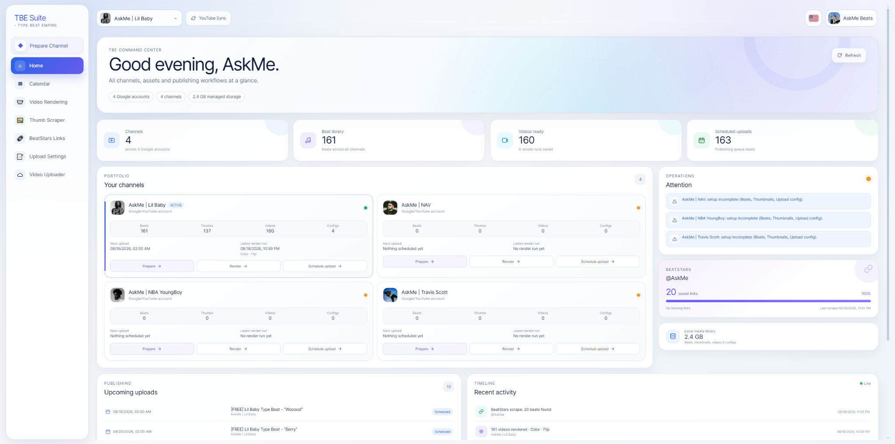
</p>

## What TBE Suite is

TBE Suite is a full-stack creator-operations workspace that takes a beat from **local media assets to a scheduled YouTube release**. It combines media processing, channel state, OAuth, external-service integrations, background workers and a guided publishing workflow in one interface.

The home dashboard acts as a command center across multiple Google accounts and channels. It surfaces channel readiness, media-library counts, storage, BeatStars coverage, upcoming uploads, recent activity and setup warnings without requiring the user to jump between tools.

### Measured workflow throughput

On my current development machine, the FFmpeg pipeline typically renders a **1080p type-beat video in ~0.84–1.00 seconds**. A recent sequential worker run averaged about **0.89 seconds per completed render**, which puts **100 finished 1080p videos at roughly 90 seconds of render time**.

The YouTube upload + scheduling stage for a 100-video batch typically takes around **5–10 minutes** on my current connection and setup. In practical use, once beats, artwork and metadata are ready, I can prepare and queue **100 daily uploads — more than three months of content — in roughly ten minutes** rather than spending hours repeating the same actions manually.

> Performance figures are measurements from my local environment, not universal guarantees. Rendering and upload times depend on hardware, network throughput and external processing.

---

# Product walkthrough

## 1. Guided channel preparation

The **Prepare Channel** workflow turns the entire process into a six-step checklist: **assets → thumbnails → BeatStars → upload config → rendering → upload**. Each step can be completed, skipped when already prepared, or resumed later. The progress indicator makes it obvious how close a channel is to being publishing-ready.

<p align="center">
  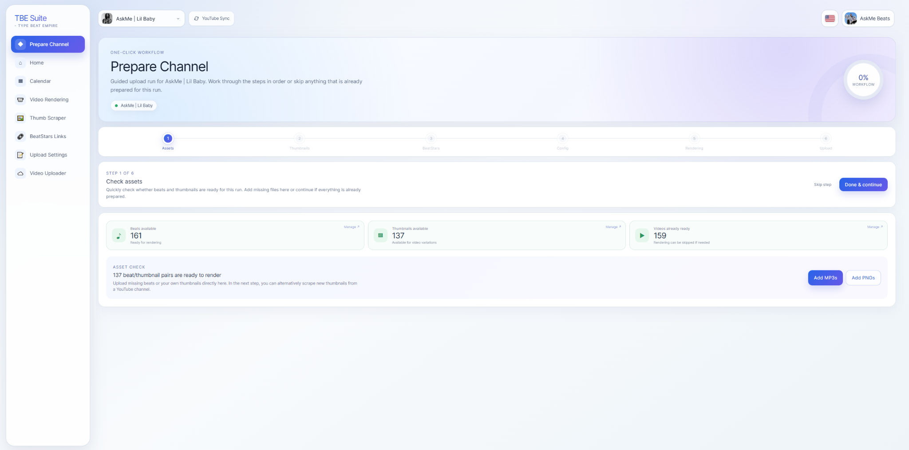
</p>

At the final step, the same workflow embeds the upload configuration directly instead of forcing the user into a separate setup flow.

<p align="center">
  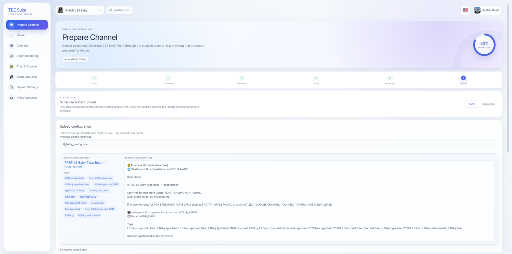
</p>

**Why it matters:** this turns a multi-tool publishing routine into a repeatable operational process that can be handed to a user without requiring them to remember every dependency between steps.

---

## 2. Channel-scoped asset management

Beats, thumbnails, rendered videos and configuration files are isolated by user and channel. The asset manager supports per-file actions, bulk selection and deletion, while still exposing useful details such as file sizes and current inventory counts.

<p align="center">
  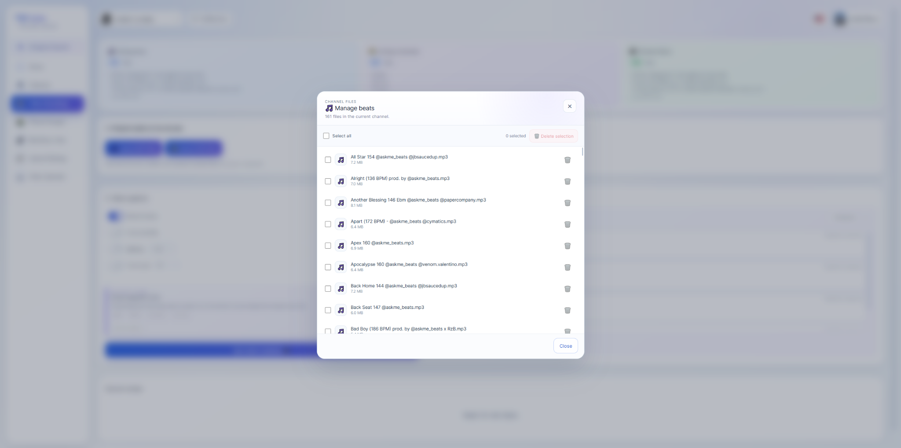
</p>

This is important for a workflow with many channels: the UI treats each channel as its own production workspace rather than one shared media folder.

---

## 3. Fast batch video rendering

The rendering workspace pairs MP3 beats with PNG artwork and sends the jobs to background workers. It supports reusable visual options such as color/B&W, horizontal flip, silence insertion and zoom, while showing current progress and the active render.

<p align="center">
  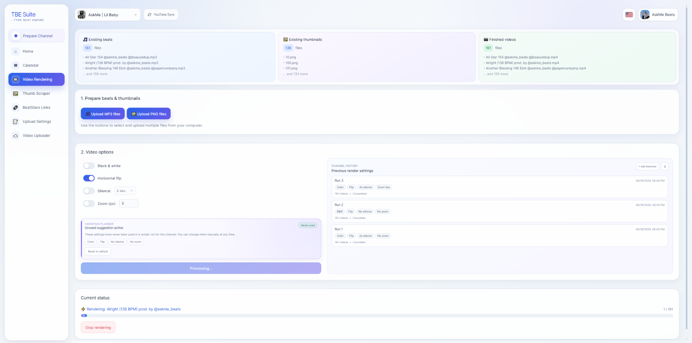
</p>

The UI also keeps **previous render settings** for the channel and includes a **variation planner** so repeated batches can deliberately vary visual settings instead of accidentally using the same treatment forever. Rendering runs outside the HTTP request lifecycle through background workers, so long-running media work does not freeze the web application.

**Observed benchmark:** ~0.84–1.00 s for a finished 1080p video on my current development setup.

---

## 4. YouTube thumbnail acquisition with live preview

The thumbnail workflow accepts a YouTube channel, detects the channel, previews recent uploads and downloads a requested number of thumbnails for the rendering pipeline.

<p align="center">
  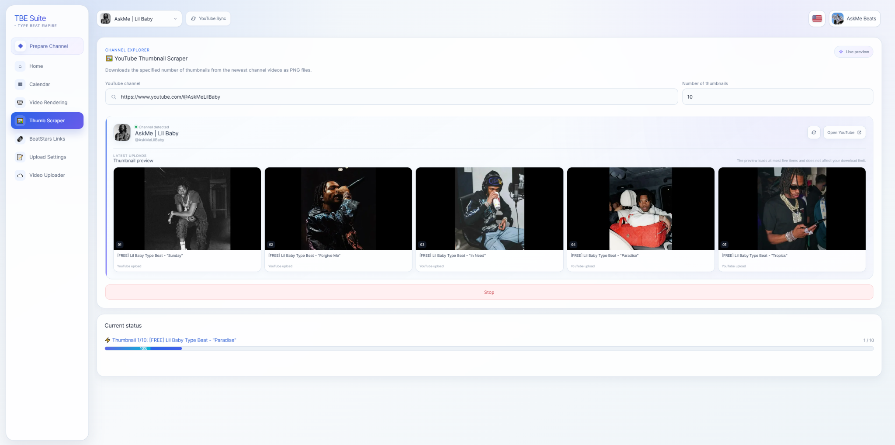
</p>

The live preview is particularly useful operationally: before starting a batch, the user can quickly verify that the correct source channel was detected and that its current visual style is the one they intend to work from.

---

## 5. BeatStars purchase-link workflow

TBE integrates BeatStars link collection into the same channel workflow. The page tracks the linked profile, requested beat count, saved/missing links, the latest scrape and scrape history.

<p align="center">
  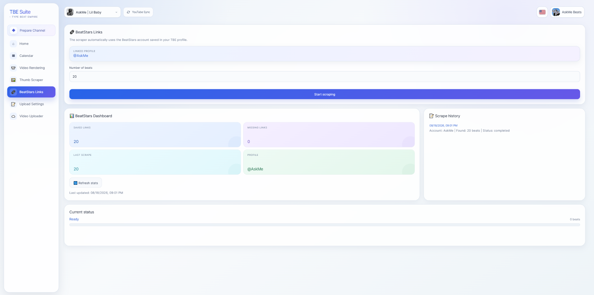
</p>

The goal is not simply scraping a page: the useful part is connecting the resulting purchase links to the same beat identities used later by the upload metadata pipeline, so the correct purchase URL can be inserted automatically at publishing time.

---

## 6. Reusable upload templates and bulk metadata editing

Upload settings are saved as reusable channel templates for **title, description and tags**. The editor supports placeholders such as beat name, BeatStars link and BPM; validates YouTube field limits; presents tags as editable chips; and includes **Find & Replace across title, description and tags at once**.

<p align="center">
  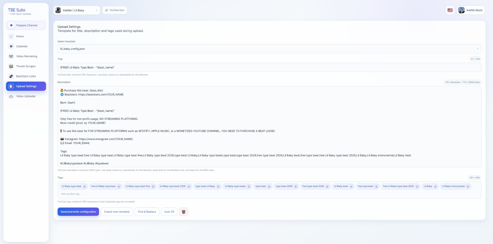
</p>

This matters when metadata conventions change across a large back catalogue — for example changing every occurrence of a year, artist keyword or campaign phrase without manually editing three separate fields.

The YouTube history importer can also infer recurring historical metadata patterns, but only promotes a pattern to a reusable config after repeated evidence rather than treating a couple of coincidentally similar uploads as a real template.

---

## 7. Batch upload and scheduling

The uploader previews the selected configuration, lets the user choose a scheduled start date/time and automatically proposes the next slot after the channel’s latest scheduled upload. A whole batch can then be published as a daily schedule rather than configured one video at a time.

<p align="center">
  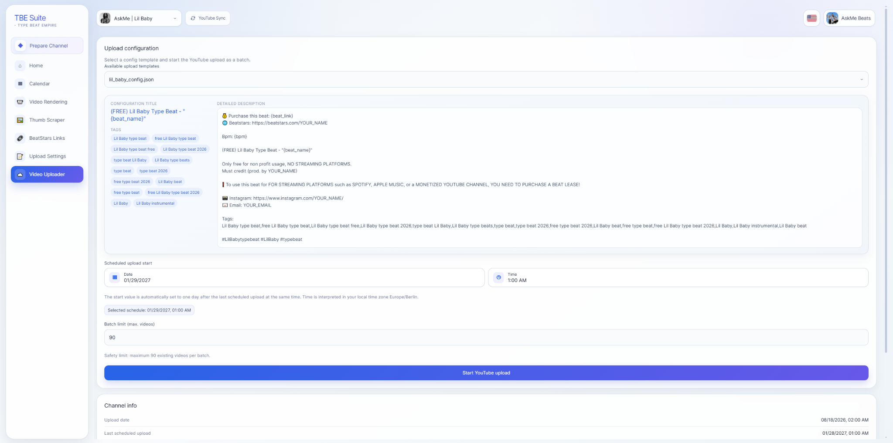
</p>

Uploads run through background jobs with resumable transfer behavior and persistent state. The UI can recover job status after navigation instead of treating an upload as a fragile one-page action.

---

## 8. Full YouTube channel sync

For existing channels, TBE can import the channel’s published and scheduled history into its own persistent model. The sync UI reports videos, scheduled releases, Shorts and recovered historical configs, and returns to the same UI context after an OAuth flow rather than dropping the user on a blank callback page.

<p align="center">
  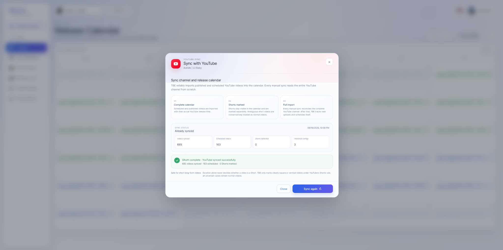
</p>

The implementation is deliberately conservative around incomplete third-party data: a partial external response is not treated as permission to erase previously known scheduled releases. OAuth authorization is also identity-checked against the expected target channel before a sync or upload can resume.

Shorts are tracked as a separate content type rather than being aggressively discarded through duration-only heuristics, which is important because many of my normal long-form type-beat videos are also relatively short.

---

## 9. Release calendar

Published and scheduled YouTube videos are normalized into a monthly release calendar. Published releases and future scheduled releases are visually distinct, making gaps or unexpected scheduling behavior immediately visible.

<p align="center">
  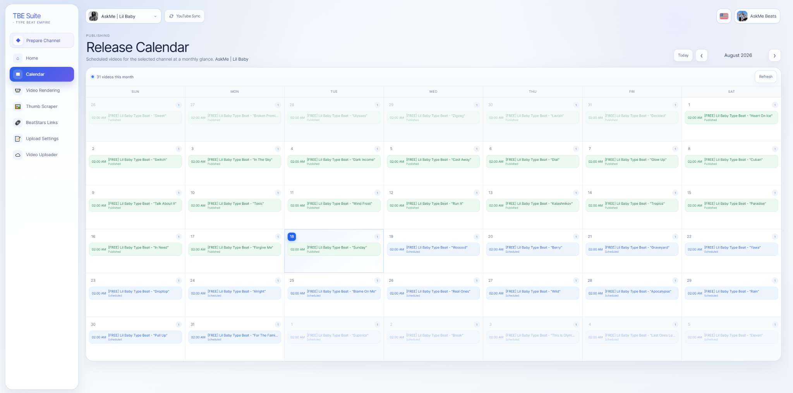
</p>

For a channel running daily uploads, this turns raw API state into an operational view: I can immediately see whether the channel is continuously scheduled and where the publishing horizon currently ends.

---

# Engineering highlights

TBE Suite is interesting to me as a software project because the difficult part was not any one API call; it was coordinating multiple failure-prone subsystems into one reliable workflow.

### Background processing

Long-running media and network work is separated from the interactive API layer using **Celery + Redis**. Rendering and upload jobs persist progress and can be cancelled without blocking FastAPI requests.

### Media pipeline

The rendering worker uses **FFmpeg** to turn beat audio and artwork into 1080p videos at high throughput. The worker captures failures, verifies output creation and reports progress back to the application.

### External-state reconciliation

YouTube is treated as an external system whose responses can be incomplete. TBE keeps durable video/schedule state and reconciles new API observations conservatively instead of blindly replacing local state.

### OAuth safety and orchestration

OAuth credentials stay backend-only. Authorization is bound to the intended account/client context and the authorized YouTube channel is verified before an operation resumes. Internal OAuth-client orchestration and external provider quota errors are deliberately modeled as separate concerns.

### Multi-user isolation

Persistent media, account state and channel state are scoped by user and channel. The application was refactored away from an older global-channel storage layout as multi-user support matured.

### Defensive automation

Browser-driven integrations and scraping workflows use bounded work, cancellation, partial-result handling and persistent caches instead of assuming every external page or network request will behave perfectly.

More detail: **[Engineering Highlights](docs/ENGINEERING_HIGHLIGHTS.md)**

---

# Architecture

<p align="center">
  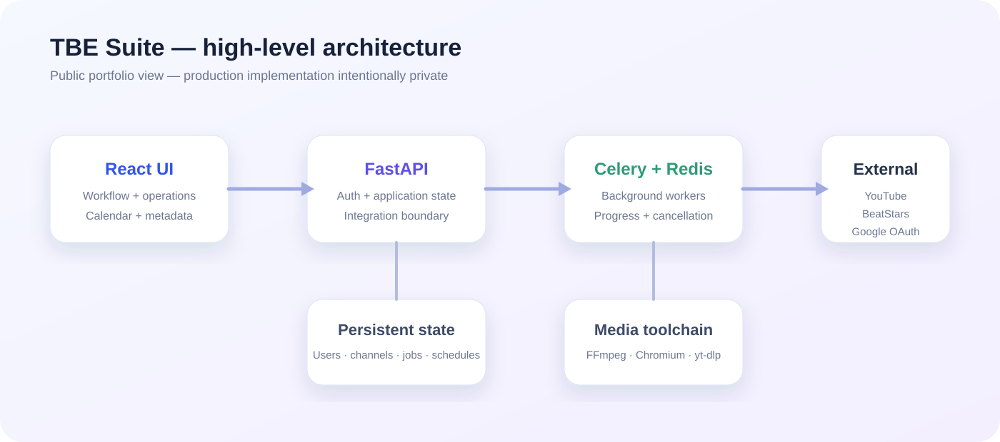
</p>

At a high level:

```text
React UI
   ↓
FastAPI application layer
   ├─ persistent application state
   ├─ Google / YouTube OAuth + API integration
   └─ background job dispatch
           ↓
      Celery + Redis
           ├─ FFmpeg media processing
           ├─ thumbnail acquisition
           ├─ BeatStars browser automation
           └─ resumable YouTube publishing
```

The production backend implementation is intentionally **not included in this public showcase repository**. This project is both a portfolio piece and something I may continue developing commercially, so the public version documents the architecture, product behavior and engineering decisions without publishing the proprietary orchestration, parsing, reconciliation and automation code.

More detail: **[Architecture Overview](docs/ARCHITECTURE.md)**

---

# Technology stack

| Area               | Technology                                            |
| ------------------ | ----------------------------------------------------- |
| Frontend           | React 19, Vite, Axios, responsive custom CSS          |
| API                | Python, FastAPI, Pydantic                             |
| Persistence        | SQLModel / SQLAlchemy, SQLite / PostgreSQL            |
| Background jobs    | Celery, Redis                                         |
| Media processing   | FFmpeg                                                |
| YouTube            | Google OAuth 2.0, YouTube Data API, resumable uploads |
| Browser automation | Selenium / Chromium                                   |
| Thumbnail workflow | yt-dlp-based acquisition                              |
| Deployment         | Docker / Docker Compose / Nginx                       |

---

# Public showcase / private source

This repository is intentionally a **portfolio snapshot rather than the production source repository**.

Included publicly:

- real product screenshots;
- system architecture at subsystem level;
- measured performance observations;
- product and engineering rationale;
- technology choices and failure-handling strategy.

Kept private:

- production backend source code;
- OAuth client credentials and token handling internals;
- provider-specific parsing/selectors;
- detailed reconciliation algorithms;
- internal scheduling/orchestration implementation;
- deployment secrets, databases and user media.

I can walk through selected implementation details and code privately in an interview context.

See **[Security & IP Notes](SECURITY.md)**.

---

## Project context

TBE Suite is an independent software-engineering project built from a real music-production business workflow. It sits at the intersection of **creator tools, media processing, platform integrations and workflow automation**, which is why I use it as a portfolio project for software roles in the music industry.
